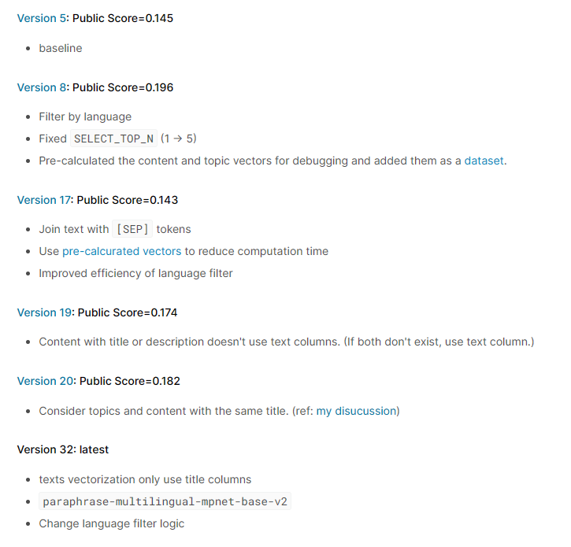

# Approaches

## Table of Contents:
- [Ideas](https://github.com/alckasoc/Learning-Equality-Curriculum-Rec/blob/main/src/approaches.md#ideas)
- [Approaches](https://github.com/alckasoc/Learning-Equality-Curriculum-Rec/blob/main/src/approaches.md#approaches)

## Ideas

- english makes up about 72% of the 30% test data for the public lb, maybe build a model specifically for english
- try something with translation models
- train a contrastive model 
- train a model to predict confidence (learnable threshold; later)
- look through past competitions and pretrain on more data and maybe on similar task
- maybe frame this as an unsupervised learning/contrastive learning problem
- separate embeddings for title, description, text
- 

## Approaches

### [LECR Simple Unsupervised Baseline](https://www.kaggle.com/code/takamichitoda/lecr-simple-unsupervised-baseline) by Takamichi Toda

* 0.235 unsupervised
* \<title\> or "no title"
* `paraphrase-multilingual-mpnet-base-v2`
* cosine similarity distance between topic and content vectors
* filter/prioritize contents with same language as topic and select top k
* match topics with contents that have same title

### [LECR Unsupervised Train Set Public](https://www.kaggle.com/code/ragnar123/lecr-unsupervised-train-set-public) by MARTIN KOVACEVIC BUVINIC

* TBD
    * Combine with 0.235 baseline : 0.207
    * 0.235 baseline + KNN and "" instead of "no title" : 0.207
    * just KNN : 0.204
* "" instead of "no title"
* KNN with k=10 with cosine metric

### (Above) & [LECR xlm-roberta-base Baseline](https://www.kaggle.com/code/ragnar123/lecr-xlm-roberta-base-baseline) & [LECR Inference P](https://www.kaggle.com/code/ragnar123/lecr-inference-p) by MARTIN KOVACEVIC BUVINIC

* 0.297
* 