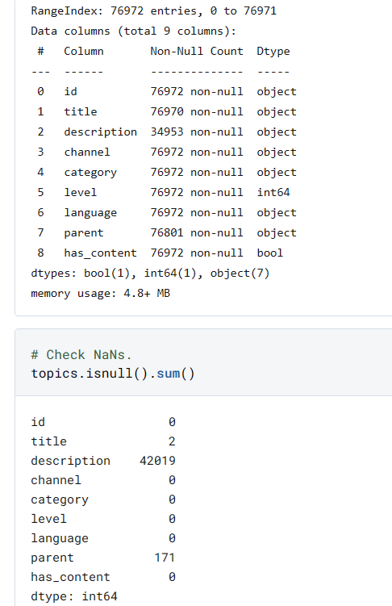

# Eda Findings

## General Info
 

#### **Goal**
The goal of this competition is to streamline the process of matching educational content to specific topics in a curriculum. You will develop an accurate and efficient model trained on a library of K-12 educational materials that have been organized into a variety of topic taxonomies. These materials are in diverse languages, and cover a wide range of topics, particularly in STEM (Science, Technology, Engineering, and Mathematics).
  

#### **Dataset Debrief**
`topics.csv` - Contains a row for each topic in the dataset. These topics are organized into "channels", with each channel containing a single "topic tree" (which can be traversed through the "parent" reference). **Note that the hidden dataset used for scoring contains additional topics not in the public version. You should only submit predictions for those topics listed in sample_submission.csv.**

* `id` - A unique identifier for this topic.
* `title` - Title text for this topic.
* `description` - Description text (may be empty)
* `channel` - The channel (that is, topic tree) this topic is part of.
* `category` - Describes the origin of the topic.
    * `source` - Structure was given by original content creator (e.g. the topic tree as imported from Khan Academy). **There are no topics in the test set with this category.**
    * `aligned` - Structure is from a national curriculum or other target taxonomy, with content aligned from multiple sources.
    * `supplemental` - This is a channel that has to some extent been aligned, but without the same level of granularity or fidelity as an aligned channel.
* `language` - Language code for the topic. May not always match apparent language of its title or description, but will always match the language of any associated content items.
* `parent` - The id of the topic that contains this topic, if any. This field if empty if the topic is the root node for its channel.
* `level` - The depth of this topic within its topic tree. Level 0 means it is a root node (and hence its title is the title of the channel).
* `has_content` - Whether there are content items correlated with this topic. Most content is correlated with leaf topics, but some non-leaf topics also have content correlations.

`content.csv` - Contains a row for each content item in the dataset. Note that the hidden dataset used for scoring contains additional content items not in the public version. These additional content items are only correlated to topics in the test set. **Some content items may not be correlated with any topic.**

`correlations.csv` - The content items associated to topics in the training set. A single content item may be associated to more than one topic. In each row, we give a topic_id and a list of all associated content_ids. These comprise the targets of the training set.
  

## Our Findings
 

### Topics

* topics.csv shape: `(76972, 9)`
* 171 channels/topic trees (because there are 171 root nodes with no parent)
* 2 missing titles
* `level` ranges from 0 to 10
* `category`: source          43487 | supplemental    19368 | aligned         14117
* 28 unique languages; en and es most dominant (english and espanol?)
* `has_content`: True     61517 | False    15455
* `title`s are not unique
* channels/topic trees can have multiple languages
* channels/topic trees can have duplicate titles
* channels/topic trees can have titles that duplicate in other channels
* a channel can only consist of nodes corresponding to 1  of the categories: `source`, `aligned`, or `supplemental`
* number of root nodes per `category`: {'aligned': 27, 'source': 77, 'supplemental': 67}
* number of root nodes per `has_content`: {True: 10, False: 161} 
* a node can only have 1 parent, but can have multiple children nodes
* refer to CSVs in `input/eda_csv`

| language   | root node cnt  |
| :--------: | :------------: |
| bg | 1 |
| en | 82 |
| pt | 9 |
| gu | 3 |
| my | 1 |
| zh | 3 |
| ar | 12 |
| te | 0 |
| es | 29 |
| fr | 7 |
| sw | 2 |
| mr | 1 |
| hi | 5 |
| bn | 5 |
| fil | 1 |
| ru | 1 |
| it | 1 |
| or | 0 |
| pnb | 0 |
| km | 1 |
| as | 1 |
| kn | 0 |
| ur | 0 |
| pl | 1 |
| ta | 0 |
| swa | 0 |
| tr | 1 |
| mul | 4 |

### Contents

* `contents` shape: (154047, 8)

* `kind`: video       61487 | document    33873 | html5       32563 | exercise    25925 | audio         199
* `license`: CC BY-NC-SA      52088 | CC BY-NC-ND       8714 | CC BY             5927 | CC BY-SA          4554 | Public Domain     2044 | CC BY-NC           691 | CC BY-ND            17
  

## [📚Learning-Equality, EDA+FE+Modeling📚](https://www.kaggle.com/code/hasanbasriakcay/learning-equality-eda-fe-modeling) by HASAN BASRI AKÇAY
 

licenses

* CC BY-NC-SA: This license lets others remix, tweak, and build upon your work non-commercially, as long as they credit you and license their new creations under the identical terms.
* CC BY-NC-ND: This license is the most restrictive license offered by Creative Commons. With this license, the user (while attributing the original creator) can only share the work but not change it in any way or ever use it commercially.
* CC BY-SA: This license allows reusers to distribute, remix, adapt, and build upon the material in any medium or format, so long as attribution is given to the creator.
* CC BY: This license allows reusers to distribute, remix, adapt, and build upon the material in any medium or format, so long as attribution is given to the creator. The license allows for commercial use.
Public Domain: Public-domain-equivalent license are licenses that grant public-domain-like rights and/or act as waivers. They are used to make copyrighted works usable by anyone without conditions, while avoiding the complexities of attribution or license compatibility that occur with other licenses.
* CC BY-NC: This license allows reusers to distribute, remix, adapt, and build upon the material in any medium or format for noncommercial purposes only, and only so long as attribution is given to the creator.
* CC BY-ND: This license allows reusers to copy and distribute the material in any medium or format in unadapted form only, and only so long as attribution is given to the creator. The license allows for commercial use.

### Correlations

* `correlations` shape: (61517, 2)w

  

## [Modeling Oriented EDA + Building a Good CV Split](https://www.kaggle.com/code/theoviel/modeling-oriented-eda-building-a-good-cv-split) by THEO VIEL
 
* Note that there are no topics with the "source" category in the test set, so you should ignore these for validation.

  